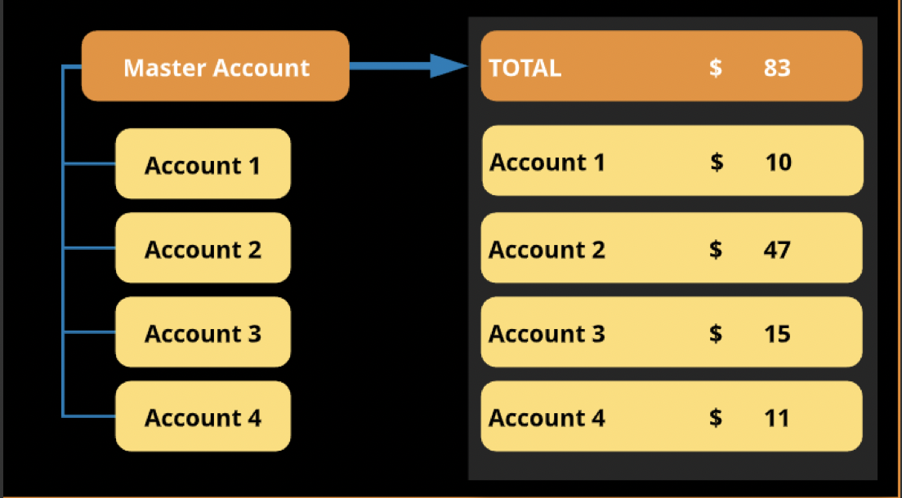
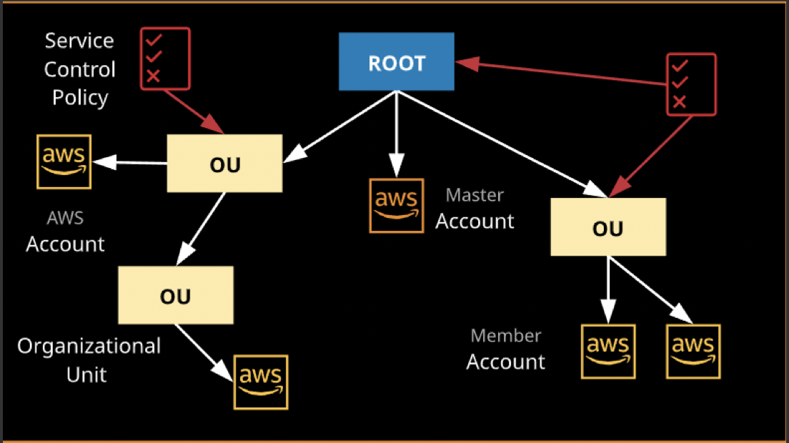
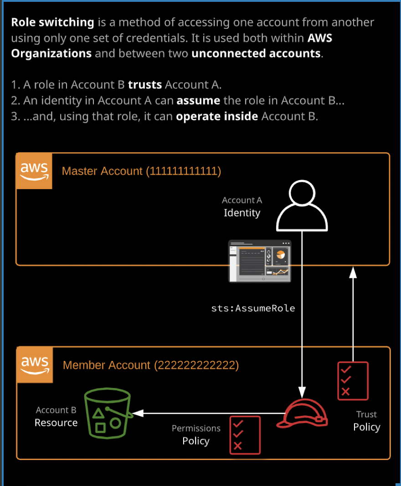
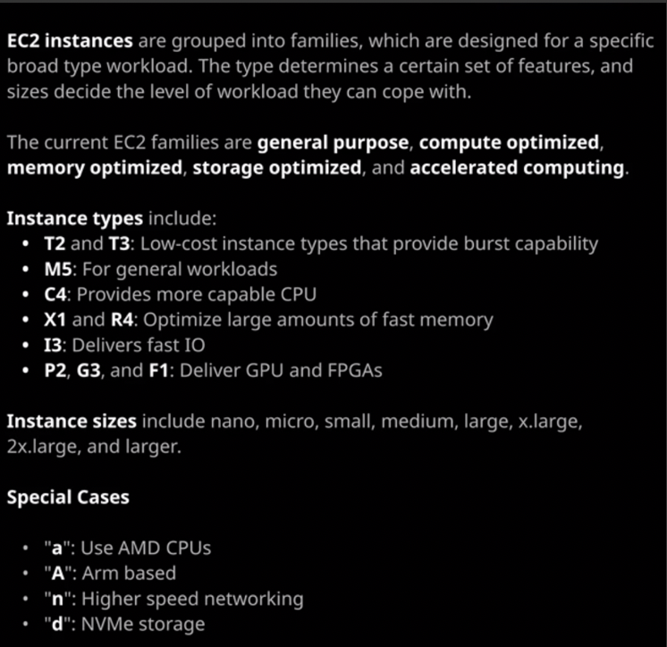
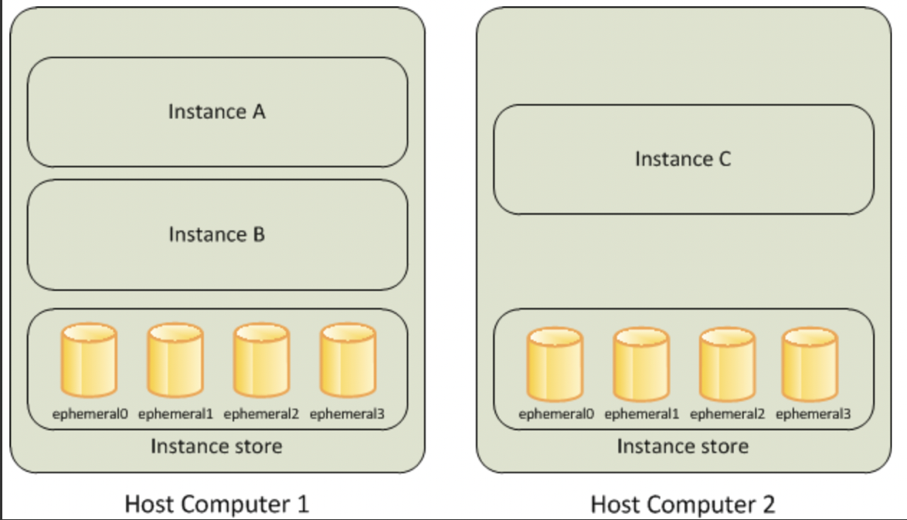
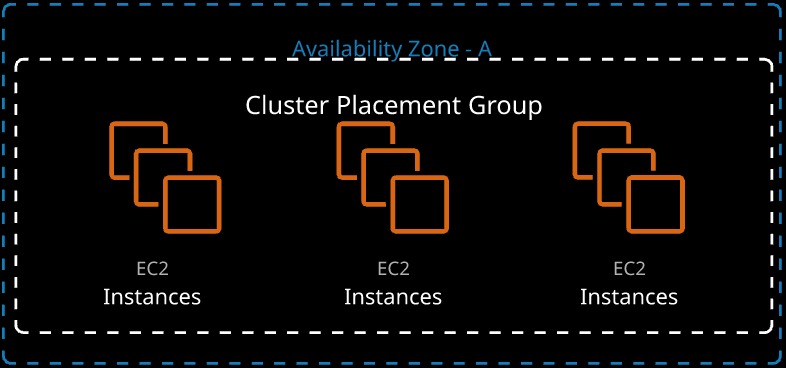
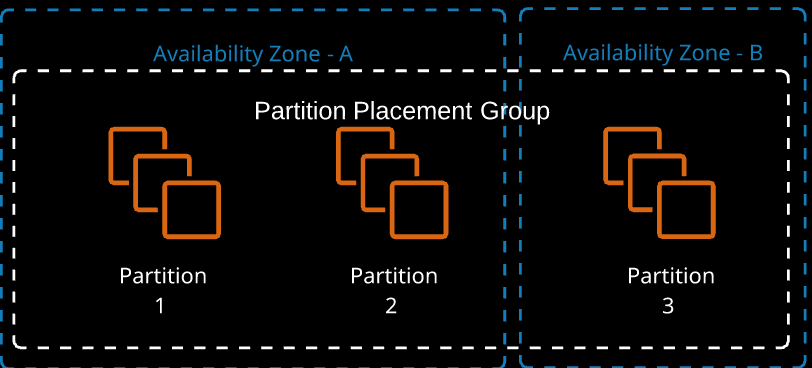
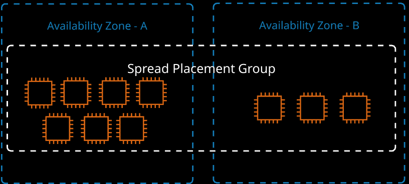
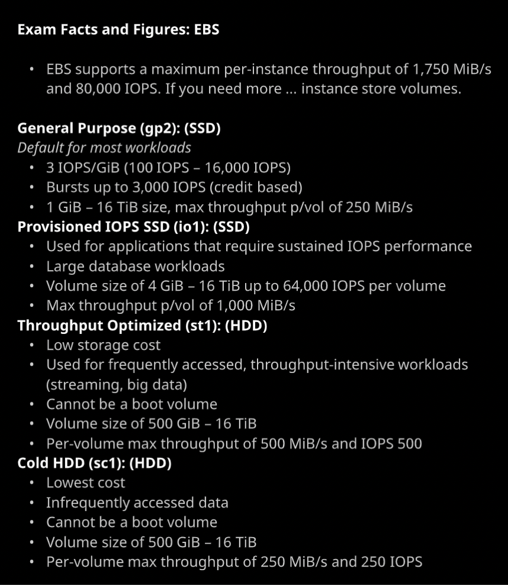
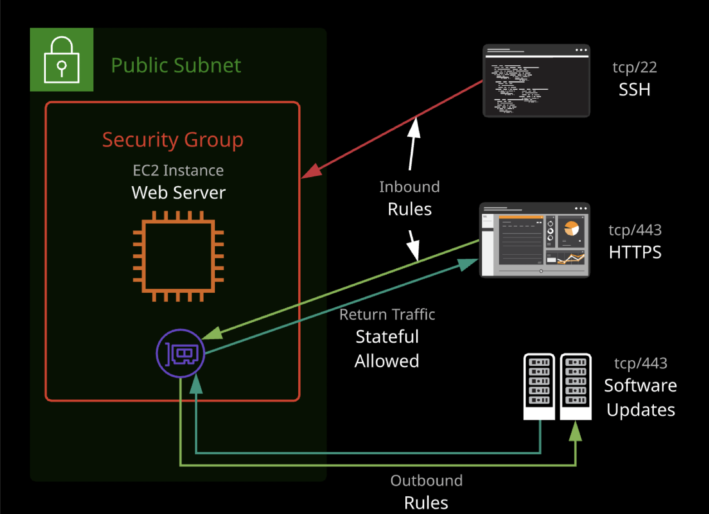

# aws-solutionsarchitect-associate-exam-notes
AWS Solution Architect Exam Notes

# 1- MULTI-ACCOUNT MANAGEMENT AND ORGANIZATIONS


**Consolidated Billing**




**Organizational Units Logic**




* You can create two accounts into OUs by default but you can create ticket for AWS Support in order to increase limit of accounts.

**Role Switching Between Accounts**

* When you create account with AWS Organization, OrganizationAccountAccessRoles automatically installed in target account(Member Account). 




**Service Control Policy**
* Service control policies (SCPs) are one type of policy that you can use to manage your organization. SCPs offer central control over the maximum available permissions for all accounts in your organization, allowing you to ensure your accounts stay within your organization’s access control guidelines. SCPs are available only in an organization that has all features enabled. SCPs aren't available if your organization has enabled only the consolidated billing features. 
* The only way to restrict root user is Service Control Policy.
* Master account can not be restricted with Service Control Policy.
* Dedicated hosts are EC2 hosts for a given type and size that can be dedicated to you. The number of instances that can run on the host is fixed - depending on the type and size. An on-demand or reserved fee is charged for the dedicated host - there are no charges for instances running on the host. Dedicated hosts are generally used when software is licensed per core/CPU an not compatible with running within a shared cloud environment.
* Three main reasons for using a dedicated host:
1. To meet compliance and regulatory requirements
2. To control instance placement
3. When bringing your own software license


# 2- EC2

* You can not see datas in EC2 such as memory utilization in Cloudwatch monitoring for EC2. You can set agent in EC2 and connect it to Cloudwatch.
* Every account has limited EC2 size. You can increase by creating ticket.
* When you create EC2 you can see Health Check in console 2/2 checks. First is hardware second is EC2 itself.
* You will be charged if you shutdown OS instead of changing EC2 state to stop.
* Even if you stop EC2, you will be charged for EBS volume. You need to terminate instance in order to remove EBS.
* In order to get instance IP, AMI ID, instance type, etc… in your code, there is a http endpoint which you can send request and retrieve information.

```

[ec2-user ~]$ curl http://169.254.169.254/latest/meta-data/    
ami-id
ami-launch-index
ami-manifest-path
block-device-mapping/
events/
hostname
iam/
instance-action
instance-id
instance-type
local-hostname
local-ipv4
mac
metrics/
network/
placement/
profile
public-hostname
public-ipv4
public-keys/
reservation-id
security-groups
services/

``` 
```

[ec2-user ~]$ curl http://169.254.169.254/latest/meta-data/ami-id
ami-0abcdef1234567890

```
```
[ec2-user ~]$ curl http://169.254.169.254/latest/meta-data/public-hostname
ec2-203-0-113-25.compute-1.amazonaws.com

```
* Instance EC2 types: https://aws.amazon.com/ec2/instance-types/





* An instance store provides temporary block-level storage for your instance.
* Benefits of instance store is EC2 can directly access it because of hosting on same host computer.
* Trade off instances store is that if host computer fails datas will be lost.




* They are included price in EC2’s except Storage Optimized EC2s.
* Level of OS and instance, if you restart OS or instance instance store is still available. The only way to remove instance store is stopping instance.
* EBS has Solid-State Drives(SSD) and Hard Disk Drives(HDD).
* SSD mainly focused on IOPS, HDD mainly focuses Throughput.
* IOPS is related with input-output rates, Throughput is related with data read-write rates.
* If you need more than 80.000 IOPS you need to use instance store.
* You can change instance type and size whenever you want without data lost.
* There are 3 types of Placement Groups
	1. *Cluster PG:* It has well performanced PG type. The best practice is to run EC2 type in the same time and with same types. In Cluster PG, all EC2s can be in one AZ.
	2. *Partition PG:* It's designed for application availability. If one partition groups fails other will not be affected. Instances deployed into a partition placement group(PPG) are separated into partitions (max of seven per AZ), each occupying isolated racks in AZs/regions. PPG can span multiple AZs in a region. PPGs minimize failure to a partition and give you visibility on placement. PG group is best used for large EC2 infrastructure deployment.
	3. *Spread PG:* SPGs, are designed for a max of seven instances per AZ that need to be seperated. Each instance occupies a partition and has an isolated fault domain.



	


    
## EBS

* If you take snapshots of EBS, it will be copied to S3 bucket.
* Best way to take a snapshot is stopping instance and take snapshot of it. Because while taking snapshot there can be datas on memory which is not written into disk. So firstly, if you stop the instance memory datas will be written into disk after that takes the snapshot.
* EBS is the service which resides in Availability Zones. In the case of failing AZ, taking snapshot is going to save life because S3 service duplicates itself in different AZs.
* There are two options which are you can provide permission in between another AWS accounts in private or make it public in order to see by all AWS accounts.
* You can create volumes from snapshots. Even if snapshot is taken by volume which is in A AZ, there is an option that it can be created volume in B AZ by snapshot.
* Snapshots can be copied between different regions in order to prevent disasters.
* Snapshot creations and deletions must not be manually, it can be automated by “Data Lifecyle Manager” service.
* Snapshots is taken incrementally. If one of snapshot would be deleted others can relies previous ones.
* It's possible to change default behaviour of EBS, it can be default encrypted or non encrypted.
* Whenever you create EBS from snapshot it uses same encryption key as snapshot's.
* Whenever you want to create encrypted EBS it creates AWS Managed KMS key. KMS Service is regional service.
* In order to encrypt or decrypt the EBS it has to be requested via KMS.
* You can not create unencrypted snapshot.
* EC2 does not have knowledge about encryption process. OS support OS level encryption but it's only available for file system. It does not encrypt for EBS volume.
* EBS optimization mode, which was historically optinal and is now the default, adds optimizations and dedicated communications paths for storage and traditional data networking. This allows consistent utilization of both - and is one required feature to support higher performance storage.




## SECURITY GROUPS

* Security groups are attached to physically interface which surrounds the EC2 instance.
* Maximum five SG can be attached to interface.
* SG can be in one VPC.
* SG has by default implicit DENY rules.
* You are not allowed to add explicitly DENY rule. For example, you want to provide EC2 instance access for ten people but one of them has infected computer which you do not want to him access. That’s why you need to set smaller IP CIDR block.
* It does not required to refer IPs in every time. You can set other security groups as well as inbound rules.
* SGs are stateful which means there is a data transfer between client and server. Just imagine, when you send a request to website via browser, browser send a request to server and get datas back in order to show them in browser because of outbound traffic rules are opened for 0.0.0.0/0 which means all. As a second example, you connected server with SSH and want to update “yum” package. Please have a look below image for better understanding.



## AMI

* There are two types of instances which are instance stored backed AMI and EBS backed AMI.
* The best practice is to create an AMI is stopping instance firstly because of consistency.
* AMI creates snapshots of EBS volumes, that snapshot includes instance’s root volume, permissions which are public and private. While launching instance with AMI, instance already have block mapping device because of AMI.
* AMIs can be used for various scenarios. If there is a complex architecture, using immutable architecture and in deploying rapidly.
* Privately shared but with whitelisting
* The EC2 Instance type and size for the source instance is not stored in a custom AMI when creating a pre-configured source instance
* Privately sharable images
* Searchable public images

## Bootstrapping

* Biggest advantage of baking AMI is that decreasing time of provisioning of instance.
* It’s not able to do dynamic configurations, whenever you already created configurations in AMI you are not able to change it dynamically.
* The advantage of bootstrapping is dynamically usage, disadvantage of is increasing time of provisioning.

## ELASTIC NETWORK INTERFACES (ENI)

* EC2 instances can be configured with or without public IPv4/6 IP addressing.
* An elastic network interface (referred to as a network interface in this documentation) is a logical networking component in a VPC that represents a virtual network card.
* A network interface can include the following attributes:
    1. A primary private IPv4 address from the IPv4 address range of your VPC
    2. One or more secondary private IPv4 addresses from the IPv4 address range of your VPC
    3. One Elastic IP address (IPv4) per private IPv4 address
    4. One public IPv4 address
    5. One or more IPv6 addresses
    6. One or more security groups
    7. A MAC address
    8. A source/destination check flag
    9. A description
* You can create and configure network interfaces in your account and attach them to instances in your VPC.
* You can create a network interface, attach it to an instance, detach it from an instance, and attach it to another instance.
* Every instance in a VPC has a default network interface, called the primary network interface (eth0). You cannot detach a primary network interface from an instance.
* NAT Gateway translate private IP to public IP in order to access internet, also otherwise.
* When you reboot instance, public IP and public DNS do not change, but if you terminate or stop instance public IP changes.
* The default ENI is eth0.
* An ENI is assigned an IP.
* An EC2s instance size delegates the amount of assignable IP’s.
* Public IPs should be assigned to an EC2 for internet communication.
* When the instance is terminated private IP is released.
* ip-x-x-x-x.ec2.internal is the naming convention for a private DNS of EC2 instances.

## INSTANCE ROLES

* EC2 Instance roles are IAM roles that can be “assumed” by EC2 using an intermediary called an instance profile.
* An instance role sets permissions to an EC2 application or instance. An instance profile is a container for passing IAM roles information to EC2.
* An instance profile is either created automatically when using the console UI or manually when ısing the CLI.
* The instance profile allows applications on the EC2 instance to access the credentials from the role using the instance metadata.
* Instance roles are temporary credentials which has limited time.

## EC2 BILLING MODELS
	
1. **Spot Instances:** Spot instances allow consumption of spare AWS capacity for a given instance type and size in a specific AZ. Instances are provided for as long as your bid price is above the spot price, and you only ever pay the spot price. If your bid is exceeded, instances are terminated with a two-minute warning.
Spot instances are perfect for non-critical workloads, burst workloads, or consistent non-critical jobs that can tolerate interruptions without impacting functionality. Sport is not suitable for long-running workloads that require stability and cannot tolerate interruptions.
2. **Reserved Instances:** Rserved instances lock in a reduced rate for one or three years. Zonal reserved instances include a capacity reservation. Your commitment incurs costs even if instances aren't launced. Reserved purchases are used for long-running, understood, and consistent worloads. 
Zonal reservations mean that you can reserve EC2 instances in a chosen Availablity Zone, most importantly, this choice locks you to one instance size.

**Key Facts**
* Instance size/type have in AZ spot price.
* Bid more, instance provisioned for spot price. Less = termination.
* Spot fleets are containers, allowing capacity to be managed.
* Reservations are zonal(AZ) or regional.
* One or three years, no upfront, partial upfront, all upfront.
* You pay regardless of EC2 instance using a reservation.
* Regional is more flexible - but has no capacity reservation.

**When to use reserved purchases**
* Base/consistent load
* Known and understood growth
* Critical systems/components

**When to use sport instances/fleets**
* Burst-y workloads
* Cost-critical, which can cope with interruption

**When to use on-demand**
* Default or unknown demand
* Anything in between reserved/spot
* Short-term workloads that cannot tolerate interruption

# 3- SERVERLESS COMPUTE (LAMBDA)
* A microservicesarchitecture is the inverse of a monolithic architecture. Instead of having all system functions in one codebase, components are separated into microservices and operate independetly. A microservice does one thing - and does it well. Operations, updates, and scaling can be done on a per-microservice basis.
* Microservices operate as independent applications. They allow direct communication between components and the end user. If one part of the system requires more capacity, that service can be scaled and updated as needed.
* You caccess the AWS Console via a user interface, which is designed for a human being. An API (or application programming interface) is an interface accessed(consumed) by another service or application.
* An API endpoin hosts on or more APIs and makes them available on a network (private or public internet). APIs remain static - they are abstracted from what the code inside the service is doin. API consumers don't care how things are done - only that the interface works. That's what aloows lower-risk changes.
* Serverless architecture consists of two main principles, including BaaS(or Backend as a Service), which means using third-party services where possible rather than running your own. Examples include Auth0 or Cognito for authentication and Firebase or DynamoDB for data storage.
* Serverless also means using an event-driven architecture where possible, using FaaS(or Function as a Service) products to provide application logic. These functions are only active(invoked) when they are needed (when an event is received).
1. Lambda Function
* Lambda is an essential service in AWS. It's a Function-as-a-Service product that is a key part of event-driven and serverless architectures.
* Functions can consume inter API endpoints or other services, functions can be allowed access to a VPC - allowing private resource access, Access to AWS services is provided by the functions's execution role. This role is assumed by Lambda, and temporary security credentials are available to the function via STS.
* In the Lambda if you want to import external libraries you need to upload file as zip file or from S3 bucket.
* You can provide environment variable within Lambda.
* There is time out which is 15 minutes. You can not exceed 15 minutes running time in Lambda.
2. API Gateway

