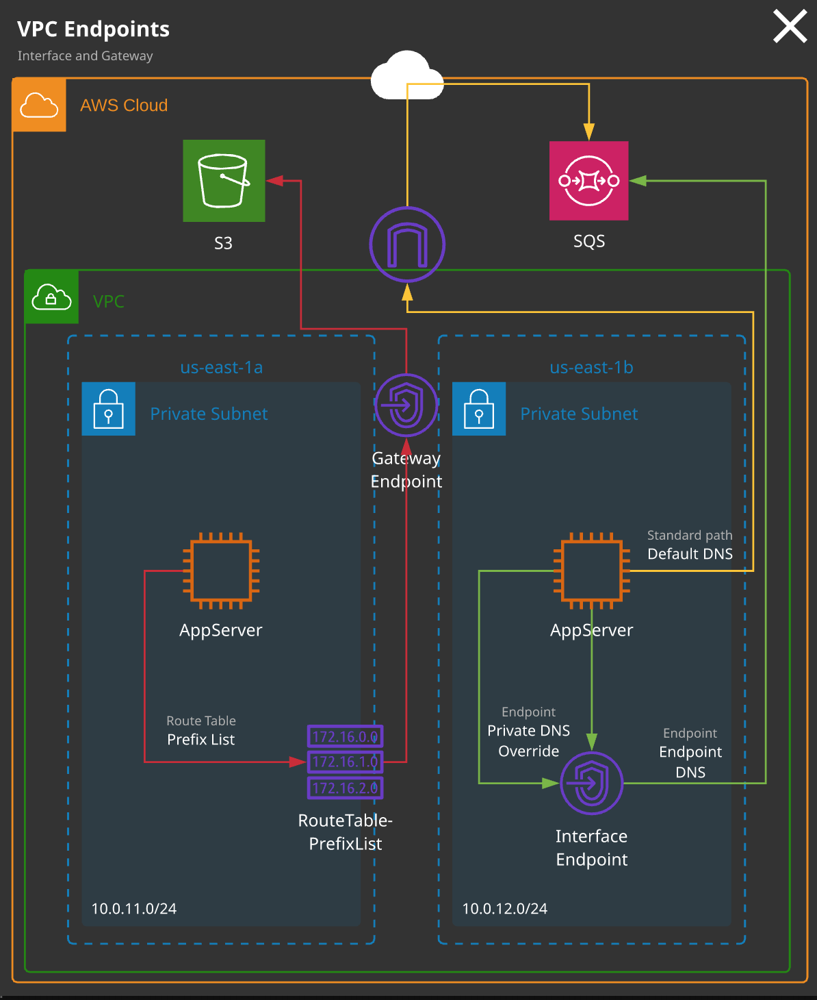

# aws-solutionsarchitect-associate-exam-notes
AWS Solution Architect Exam Notes

# 1- MULTI-ACCOUNT MANAGEMENT AND ORGANIZATIONS


**Consolidated Billing**


**Organizational Units Logic**


* You can create two accounts into OUs by default but you can create ticket for AWS Support in order to increase limit of accounts.

**Role Switching Between Accounts**

* When you create account with AWS Organization, OrganizationAccountAccessRoles automatically installed in target account(Member Account). 


**Service Control Policy**
* Service control policies (SCPs) are one type of policy that you can use to manage your organization. SCPs offer central control over the maximum available permissions for all accounts in your organization, allowing you to ensure your accounts stay within your organization’s access control guidelines. SCPs are available only in an organization that has all features enabled. SCPs aren't available if your organization has enabled only the consolidated billing features. 
* The only way to restrict root user is Service Control Policy.
* Master account can not be restricted with Service Control Policy.
* Dedicated hosts are EC2 hosts for a given type and size that can be dedicated to you. The number of instances that can run on the host is fixed - depending on the type and size. An on-demand or reserved fee is charged for the dedicated host - there are no charges for instances running on the host. Dedicated hosts are generally used when software is licensed per core/CPU an not compatible with running within a shared cloud environment.
* Three main reasons for using a dedicated host:
1. To meet compliance and regulatory requirements
2. To control instance placement
3. When bringing your own software license


# 2- EC2

* You can not see datas in EC2 such as memory utilization in Cloudwatch monitoring for EC2. You can set agent in EC2 and connect it to Cloudwatch.
* Every account has limited EC2 size. You can increase by creating ticket.
* When you create EC2 you can see Health Check in console 2/2 checks. First is hardware second is EC2 itself.
* You will be charged if you shutdown OS instead of changing EC2 state to stop.
* Even if you stop EC2, you will be charged for EBS volume. You need to terminate instance in order to remove EBS.
* In order to get instance IP, AMI ID, instance type, etc… in your code, there is a http endpoint which you can send request and retrieve information.

```

[ec2-user ~]$ curl http://169.254.169.254/latest/meta-data/    
ami-id
ami-launch-index
ami-manifest-path
block-device-mapping/
events/
hostname
iam/
instance-action
instance-id
instance-type
local-hostname
local-ipv4
mac
metrics/
network/
placement/
profile
public-hostname
public-ipv4
public-keys/
reservation-id
security-groups
services/

``` 
```

[ec2-user ~]$ curl http://169.254.169.254/latest/meta-data/ami-id
ami-0abcdef1234567890

```
```
[ec2-user ~]$ curl http://169.254.169.254/latest/meta-data/public-hostname
ec2-203-0-113-25.compute-1.amazonaws.com

```
* Instance EC2 types: https://aws.amazon.com/ec2/instance-types/


* An instance store provides temporary block-level storage for your instance.
* Benefits of instance store is EC2 can directly access it because of hosting on same host computer.
* Trade off instances store is that if host computer fails datas will be lost.


* They are included price in EC2’s except Storage Optimized EC2s.
* Level of OS and instance, if you restart OS or instance instance store is still available. The only way to remove instance store is stopping instance.
* EBS has Solid-State Drives(SSD) and Hard Disk Drives(HDD).
* SSD mainly focused on IOPS, HDD mainly focuses Throughput.
* IOPS is related with input-output rates, Throughput is related with data read-write rates.
* If you need more than 80.000 IOPS you need to use instance store.
* You can change instance type and size whenever you want without data lost.
* There are 3 types of Placement Groups
	1. *Cluster PG:* It has well performanced PG type. The best practice is to run EC2 type in the same time and with same types. In Cluster PG, all EC2s can be in one AZ.
	2. *Partition PG:* It's designed for application availability. If one partition groups fails other will not be affected. Instances deployed into a partition placement group(PPG) are separated into partitions (max of seven per AZ), each occupying isolated racks in AZs/regions. PPG can span multiple AZs in a region. PPGs minimize failure to a partition and give you visibility on placement. PG group is best used for large EC2 infrastructure deployment.
	3. *Spread PG:* SPGs, are designed for a max of seven instances per AZ that need to be seperated. Each instance occupies a partition and has an isolated fault domain.


	


    
## EBS

* If you take snapshots of EBS, it will be copied to S3 bucket.
* Best way to take a snapshot is stopping instance and take snapshot of it. Because while taking snapshot there can be datas on memory which is not written into disk. So firstly, if you stop the instance memory datas will be written into disk after that takes the snapshot.
* EBS is the service which resides in Availability Zones. In the case of failing AZ, taking snapshot is going to save life because S3 service duplicates itself in different AZs.
* There are two options which are you can provide permission in between another AWS accounts in private or make it public in order to see by all AWS accounts.
* You can create volumes from snapshots. Even if snapshot is taken by volume which is in A AZ, there is an option that it can be created volume in B AZ by snapshot.
* Snapshots can be copied between different regions in order to prevent disasters.
* Snapshot creations and deletions must not be manually, it can be automated by “Data Lifecyle Manager” service.
* Snapshots is taken incrementally. If one of snapshot would be deleted others can relies previous ones.
* It's possible to change default behaviour of EBS, it can be default encrypted or non encrypted.
* Whenever you create EBS from snapshot it uses same encryption key as snapshot's.
* Whenever you want to create encrypted EBS it creates AWS Managed KMS key. KMS Service is regional service.
* In order to encrypt or decrypt the EBS it has to be requested via KMS.
* You can not create unencrypted snapshot.
* EC2 does not have knowledge about encryption process. OS support OS level encryption but it's only available for file system. It does not encrypt for EBS volume.
* EBS optimization mode, which was historically optinal and is now the default, adds optimizations and dedicated communications paths for storage and traditional data networking. This allows consistent utilization of both - and is one required feature to support higher performance storage.


## SECURITY GROUPS

* Security groups are attached to physically interface which surrounds the EC2 instance.
* Maximum five SG can be attached to interface.
* SG can be in one VPC.
* SG has by default implicit DENY rules.
* You are not allowed to add explicitly DENY rule. For example, you want to provide EC2 instance access for ten people but one of them has infected computer which you do not want to him access. That’s why you need to set smaller IP CIDR block.
* It does not required to refer IPs in every time. You can set other security groups as well as inbound rules.
* SG can be shared across two VPCs in the same region, multiple EC2s instances in a VPC, AWS accounts in the same region, not in regions
* SGs are stateful which means there is a data transfer between client and server. Just imagine, when you send a request to website via browser, browser send a request to server and get datas back in order to show them in browser because of outbound traffic rules are opened for 0.0.0.0/0 which means all. As a second example, you connected server with SSH and want to update “yum” package. Please have a look below image for better understanding.


## AMI

* There are two types of instances which are instance stored backed AMI and EBS backed AMI.
* The best practice is to create an AMI is stopping instance firstly because of consistency.
* AMI creates snapshots of EBS volumes, that snapshot includes instance’s root volume, permissions which are public and private. While launching instance with AMI, instance already have block mapping device because of AMI.
* AMIs can be used for various scenarios. If there is a complex architecture, using immutable architecture and in deploying rapidly.
* Privately shared but with whitelisting
* The EC2 Instance type and size for the source instance is not stored in a custom AMI when creating a pre-configured source instance
* Privately sharable images
* Searchable public images

## Bootstrapping

* Biggest advantage of baking AMI is that decreasing time of provisioning of instance.
* It’s not able to do dynamic configurations, whenever you already created configurations in AMI you are not able to change it dynamically.
* The advantage of bootstrapping is dynamically usage, disadvantage of is increasing time of provisioning.

## ELASTIC NETWORK INTERFACES (ENI)

* EC2 instances can be configured with or without public IPv4/6 IP addressing.
* An elastic network interface (referred to as a network interface in this documentation) is a logical networking component in a VPC that represents a virtual network card.
* A network interface can include the following attributes:
    1. A primary private IPv4 address from the IPv4 address range of your VPC
    2. One or more secondary private IPv4 addresses from the IPv4 address range of your VPC
    3. One Elastic IP address (IPv4) per private IPv4 address
    4. One public IPv4 address
    5. One or more IPv6 addresses
    6. One or more security groups
    7. A MAC address
    8. A source/destination check flag
    9. A description
* You can create and configure network interfaces in your account and attach them to instances in your VPC.
* You can create a network interface, attach it to an instance, detach it from an instance, and attach it to another instance.
* Every instance in a VPC has a default network interface, called the primary network interface (eth0). You cannot detach a primary network interface from an instance.
* NAT Gateway translate private IP to public IP in order to access internet, also otherwise.
* When you reboot instance, public IP and public DNS do not change, but if you terminate or stop instance public IP changes.
* The default ENI is eth0.
* An ENI is assigned an IP.
* An EC2s instance size delegates the amount of assignable IP’s.
* Public IPs should be assigned to an EC2 for internet communication.
* When the instance is terminated private IP is released.
* ip-x-x-x-x.ec2.internal is the naming convention for a private DNS of EC2 instances.

## INSTANCE ROLES

* EC2 Instance roles are IAM roles that can be “assumed” by EC2 using an intermediary called an instance profile.
* An instance role sets permissions to an EC2 application or instance. An instance profile is a container for passing IAM roles information to EC2.
* An instance profile is either created automatically when using the console UI or manually when ısing the CLI.
* The instance profile allows applications on the EC2 instance to access the credentials from the role using the instance metadata.
* Instance roles are temporary credentials which has limited time.

## EC2 BILLING MODELS
	
**1. Spot Instances:** Spot instances allow consumption of spare AWS capacity for a given instance type and size in a specific AZ. Instances are provided for as long as your bid price is above the spot price, and you only ever pay the spot price. If your bid is exceeded, instances are terminated with a two-minute warning.
Spot instances are perfect for non-critical workloads, burst workloads, or consistent non-critical jobs that can tolerate interruptions without impacting functionality. Sport is not suitable for long-running workloads that require stability and cannot tolerate interruptions.

**2. Reserved Instances:** Reserved instances lock in a reduced rate for one or three years. Zonal reserved instances include a capacity reservation. Your commitment incurs costs even if instances aren't launced. Reserved purchases are used for long-running, understood, and consistent worloads. 
Zonal reservations mean that you can reserve EC2 instances in a chosen Availablity Zone, most importantly, this choice locks you to one instance size.

**Key Facts**
* Instance size/type have in AZ spot price.
* Bid more, instance provisioned for spot price. Less = termination.
* Spot fleets are containers, allowing capacity to be managed.
* Reservations are zonal(AZ) or regional.
* One or three years, no upfront, partial upfront, all upfront.
* You pay regardless of EC2 instance using a reservation.
* Regional is more flexible - but has no capacity reservation.

**When to use reserved purchases**
* Base/consistent load
* Known and understood growth
* Critical systems/components

**When to use sport instances/fleets**
* Burst-y workloads
* Cost-critical, which can cope with interruption

**When to use on-demand**
* Default or unknown demand
* Anything in between reserved/spot
* Short-term workloads that cannot tolerate interruption

# 3- SERVERLESS COMPUTE (LAMBDA)
* A microservice sarchitecture is the inverse of a monolithic architecture. Instead of having all system functions in one codebase, components are separated into microservices and operate independetly. A microservice does one thing - and does it well. Operations, updates, and scaling can be done on a per-microservice basis.
* Microservices operate as independent applications. They allow direct communication between components and the end user. If one part of the system requires more capacity, that service can be scaled and updated as needed.
* You can access the AWS Console via a user interface, which is designed for a human being. An API (or application programming interface) is an interface accessed(consumed) by another service or application.
* An API endpoint hosts on or more APIs and makes them available on a network (private or public internet). APIs remain static - they are abstracted from what the code inside the service is doin. API consumers don't care how things are done - only that the interface works. That's what aloows lower-risk changes.
* Serverless architecture consists of two main principles, including BaaS(or Backend as a Service), which means using third-party services where possible rather than running your own. Examples include Auth0 or Cognito for authentication and Firebase or DynamoDB for data storage.
* Serverless also means using an event-driven architecture where possible, using FaaS(or Function as a Service) products to provide application logic. These functions are only active(invoked) when they are needed (when an event is received).
* Server maintanance is not needed, on-demand logic, can be scaled to meet demand are benefits of FaaS.

## Lambda Function

* Lambda is an essential service in AWS. It's a Function-as-a-Service product that is a key part of event-driven and serverless architectures.
* Functions can consume inter API endpoints or other services, functions can be allowed access to a VPC - allowing private resource access, Access to AWS services is provided by the functions's execution role. This role is assumed by Lambda, and temporary security credentials are available to the function via STS.
* In the Lambda if you want to import external libraries you need to upload file as zip file or from S3 bucket.
* You can provide environment variable within Lambda.
* There is time out which is 15 minutes. You can not exceed 15 minutes running time in Lambda.
* If you chose to author a Lambda function from scratch Code and any additional libraries, function name, Runtime, Permissions are necessary.

## API Gateway

* API Gateway is a managed API endpoint service. It can be used to create, publish, monitor and secure APIs "a a service". API Gateway can use other. AWS services for compute (FaaS/IaaS) as well as to store and recall data.


* Pricing is based on the number of API Calls, the data transfered and any caching required to improve performance.
* SOAP, Web Sockets, REST are the API types.
* API Gateway can access some AWS services directly using proxy mode.
* APIs can be migrated to API Gateway in a monolithic form, and gradually moved to a microservices architecture and then once components have been fully broken up a serverless & FaaS based architecture.


## Step Functions

* Step Functions is a **serverless visual workflow service** that provides **state machines**. A state machine can orchestrate other AWS services with simple logic, branching and parallel execution, and it maintains a **state**. Workflow steps are knows as **states**, and they can perform work via **tasks**. Step Functions allows for **long-running serverless workflows**. A state machine can be defined using Amazon Sates Language(ASL).
* State machines can control AWS services.
* State machines provide simple logic, branching, merges, and parallel execution.
* SM can inform a state machine of its next state to be executed.
* SM machines maintain a state
* SM needs IAM roles.
* Without Step Functions, Lambda functions could only run for 15 minutes. Lambda functions are stateless. State machines maintain state and allow longer-runnning processes. Step Functions "replaces" SWF with a serverless version.

# 4- CONTAINERS
* A container is a package that contains an application, libraries, and file system required to run it. Containers run on a container engine that generally runs within single OS, such as Linux. Containers provide the isolation benefits of virtualization but are more lightweight, allowing faster starts and more dense packing within a host.


## Elastic Continer Service (ECS)

* EC2 is a managed container engine. It allows Docker containers to be deployed and managed within AWS environments. ECS can be use infrastructure clusters based on EC2 or Fargate where AWS manages the backing infrastructure.
* There are 2 types of ECS Mode which are EC2 Mode and Fargate Mode.
* In EC2 Mode there are server types as Windows or Linux. In the Fargate Mode there is not server, and allows AWS to fully manage the backing infrastructure.
* Docker Hub is and online container repository, also knows as a registry, meant for sharing and storing container images.
* Task Role provides ECS containers permission to access other AWS services.
* A task is a single running copy of any containers defined by a task definition
* A service allows task definitions to be scaled with the creation of more tasks.

**Hints**

**a. Cluster**: A logical collection of ECS resources - either ECS EC2 instances or a logical representation of managed Fargate infrastructure

**b. Task Definition:** Defines your application. Similar to a Dockerfile but for running containers in ECS. Can contain multiple containers.

**c. Container Definition:** Inside a task definition, a container definition defines the invidual containers a task uses. It controls the CPU and memory each container has, in addition to port mappings for the container.

**d. Task:** A single running copy of any containers defined by a task definition. One working copy of an application(e.g. DB and web containers).

**e. Service:** Allows task definitions to be scaled by adding additional tasks. Defines minimum and maximum values.

**f. Registry:** Storage for container images (e.g. ECS Container Registry or Dockerhub). Used to download image to create containers.

# 5- NETWORKING

## Virtual Private Cloud (VPC)

* A private network within AWS. It's your private data center inside the AWS platform.
* Can be configured to be public/private or mixture.
* Regional (can't span regions), highly available, and can be connected to your data center and corporate networks
* Isolated from other VPCs by default
* VPC and subnet: max /16 (65,536 IPs) and minimum /28 (16 IPs)
* Subnet CIDRs cannot overlap with other subnets inside the same VPC
* VPC subnets can't span AZs (1:1 mapping)
* Certain IPs are reserved in subnets

**Region Default VPC**

* Required for some services, used as a default for most
* Pre-configured with all required networking/security
* Configured using a /16 CIDR block /172.31.0.0/16)
* A /20 public subnet in each AZ, allocating a public IP by default
* Attached IGW with a "main" route table sending all IPv4 traffic to the IGW using 0.0.0.0/0 route
* A default DHCP option set attached
* DHCP, allows any instances in a VPC to point to the specified domain and DNS servers to resolve their domain names
* A VPC can only have one DHCP option set, 
* SG: Default - all from itself, all outbound
* NACL: Default - allow all inbound and outbound
* SG, DHCP, Public Subnet, An attached IGW, NACL are entitites which are included when a default VPC is created. Firewall is not automatically created when a default VPC is launched.

**Custom VPC**

* Can be designed and cınfigured in any valid way
* You need to allocate IP ranges, create subnets, and provision gateways and networking, as well as design and implement security.
* When you need multiple tiers or a more complex set of networking
* Best practice is to not use default for most production things
* A subnet can be shared only across accounts that are in the same AWS Organization.
* Other allowed AWS accounts can launch resources in that a shared subnet.

 

## VPC Routing

* IGW translates private IPs to public IPs, normally in the VPC resources they do not have public IPs.
* Every VPC has a virtual routing device called the VPC router.
* It has an interface in any VPC subnet know as the "subnet+1" address - for 10.0.1.0/24, this would be 10.0.1.1/32.
* The router is highly available, scalable, and controls data entering and leaving the VPC and its subnets.
* Each VPC has a "main" route table, which is allocated to all subnets in the VPC by default. A subnet must have one route table.
* Additional "custom" route tables can be created and associated with subnets - but only one route table(RT) per subnet.
* A route table controls what the VPC router does with traffic leaving a subnet.
* An IGW is created and attached to a VPC(1:1) It can route traffic for public IPs to and from the internet.

**Routes**

* A RT is a collection of routes that are used when traffic from a subnet arrives at the VPC router.
* Every route table has local route, which matches the CIDR of the VPC and lets traffic be routed between subnets.
* A route contains a destination and a target. Traffic is forwared to the target if its destination matches the route destionation.
* If multiple routes apply, the most specific is chosen. A /32 is chosen before a /24, before a /16.
* Default routes(0.0.0.0/0 v4 and ::/0 v6) can be added that match any traffic not already matched.
* Targets can be IPs or AWS networking gateway/objects
* A subnet is a public subnet if it is (1) configured to allocate public IPs, (2) if the VPC has an associated IGW, and (3) if that subnet has a default route to that IGW.

 

## Bastion Hosts (or Jumpboxes)

* A host that sits at the perimeter of a VPC
* It functions as an entry point to the VPC for trusted admins.
* Allows for updates or configuration tweaks remotely while allowing the VPC to stay private and protected
* Generally connected to via SSH (Linux) or RDP (Windows)
* Bastion hosts must be kepy updated and security hardened and audited regularly
* Multifactor authentication, ID federation and/or IP blocks
* Bastion host resides in public subnet.

## NAT Gateway

* NAT (network address translation) is a process where the source or destination attributes of an IP packet are changed. 
* **Static NAT** is the process of 1:1 translation where an internet gateway converts a private address to a public IP address. 
* **Dynamic NAT** is a variation that allows many private IP addresses to get outgoing internet access using a smaller number of public IPs (generally one). Dynamic NAT is provided within AWS using a NAT gateway that allows private subnets in an AWS VPC to access the internet. DNAT gateways are scalable.
* SNAT Gateway translates private to public IPs at a 1:1 ratio, while DNAT gateways translate a range of private IPs to public.
* When private instance connect and request something from the internet it can get response because NAT Gateway is session level product. However, from the internet can not initiate connection to private instance.
* To achieve high availability, you need to put as many NAT Gateways as you have Availability Zones. NAT Gateways do not have to match the numver of private subnets.
* Splitting the resources up and having each subnet go to its own NAT gateway will increase the avaiable bandwidth for each NAT gateway.
* Elastic IP is needed for NAT Gateway.
* It can scale itself depends on load on it.
* NAT Gateway resides in one public subnet and AZ. When AZ fails NAT Gateway also fails.
* NAT Gateway and NAT Instance Comparison: https://docs.aws.amazon.com/vpc/latest/userguide/vpc-nat-comparison.html
* NAT Gateways do not have management overhead like NAT instances do. NAT instances can act in place of a bastion host.
* NAT gateways are not supported for IPv6 traffic. Egress-only internet gateways should be used instead.

 

## Network Access Control Lists (NACLs)

* NACLs operate at layer 4 of the OSI model (TCP/UDP and below)
* A subnet has to be associated with a NACL - either the VPC default or a custom NACL.
* NACLs only impact traffic crossing the boundary of a subnet.
* NACLs are collections of rules that can explicity allow or deny traffic based on its protocol, port range, and source/destination.
* Rules are processed in number order, lowest first. When a match is found that action is taken and processing stops.
* NACLs have two sets of rules: inbound and outbound
* NACLs can be associated with one or more subnets
* Custom NACLs contain default rules
* Rule "star" which implicitly denies all traffic
* Rule 100 which allows all traffic (default NACL)
* SG are assigned to a specific resource, while NACLs are assigned to a subnet.
* SG are stateful, while NACLs are stateless.
* SG do not allow for explicit denies, while NACLs do.

**Ephemeral Ports**

* When a client initiates communications with a server, its is to a well-known port number (e.g tcp/443) on that server.
* The response is from that well-know port to an ephemeral port on the client. The client decides the port.
* NACLs are **stateless**, they have to consider both initiating and response traffic - state is session-layer concept.

## VPC Peering

* Allows direct communication between VPCs.
* Services can communicate using private IPs from VPC to VPC.
* VPC peers can span AWS accounts and even regions (with some limitations)
* Data is encrypted and transits via the AWS global backbone.
* VPC peers are used to link two VPCs at layer 3: company mergers, shared services, company and vendor, auditing.
* In order to setup Peering connection between two VPCs you have to add route and configure security allowance which can be SG or NACL.
* By editing DNS settings within the Peering Connections menu, you'll be able to resolve public IPs to private IPs.

**Important Limits and Considerations**

* VPC CIDR blocks cannot overlap.
* VPC peers connect two VPCs - routing is not transitive.
* Routes are required at both sides (remote CIDR -> peer connection)
* NACLs and SGs can be used to control access.
* SGs can be referenced but not cross-region.
* IPv6 support is not available cross-region.
* DNS resolution to private IPs can be enabled, but it's a setting needed at both sides.


* VPC transitive is not allowed. You have to define one to one peering connection.


## VPC Endpoint

* VPC Endpoints are gateway objects created within a VPC. They can be used to connect to AWS public services without the need for the VPC to have an attached gateway and be public.

**VPC Endpoint Types**

* Gateway endpoint: Can be used for DynamoDB and S3
* Gateway endpoints do not use external DNS. Instead, it uses its own AWS network to resolve AWS public services.
* Interface endpoints: Can be used for everything else (e.g, SNS, SQS)

**When to Use a VPC Endpoint**

* If the entire VPC is pirvate with no IGW
* If a specific instance has no public IP/NATHW and needs to access public services
* To access resources restricted to specific VPCs or endpoints (private S3 bucket)

**Limitations and Considerations**

* Gateway endpoints are used via route table entries - they are gateway devices. Prefix lists for a service are used in the destination field with the gateway as the target.
* Gateway endpoints can be restricted via policies.
* Gateway endpoints are HA across AZs in a region.
* Interface endpoints are interfaces in a specific subnet. For HA, you need to add multiple interfaces - one per AZ.
* Interface endpoints are controlled via SGs on that interface. NACLs also impact traffic.
* Interface endpoints add or replace the DNS for the service - no route table updates are required.
* Code changes to use the endpoint DNS, or enable private DNS to override the default service DNS.
* Similarities between gateway endpoints and interface endpoints are allow you to connect to a public AWS Service without needing a public gateway or public IP, both are VPC endpoints, both can be used to achieve high availability, However, interface endpoints are needed per AZ to achieve high availability. But The gateway interface uses a prefix list; an interface endpoint does not.

https://docs.aws.amazon.com/vpc/latest/userguide/vpc-endpoints.html



**IPv6 VPC Setup**

* It is currently optional - it is disabled by default
* To use it, the first step is to request an IPv6 allocation. Each VPC is allocated a /56 CIDR from the AWS Pool - this cannot be adjusted.
* With the VPC IPv6 range allocated, subnets can be allocated a /64 CIDR from within the /56 range.
* Resources launched into a subnet with an IPv6 range can be allocated a IPv6 address via DHCP6.
* IPv6 is attached to the operating system.

**Limitations and Considerations**

* DNS names are not allocated to IPv6 addresses.
* IPv6 addresses are all publicly routable - there is no concept of private vs. public with IPv6 (unlike IPv5 addresses)
* With IPv6, the OS is configured with this public address via DHCP6.
* Elastic IPs aren't relevant with IPv6.
* Not currently supported for VPNs, customer gateways, and VPC endpoints.

# 6- DNS

* A zone or hosted zone is a container for DNS records relating to a particular domain (e.g, google.com). Route 53 supports public hosted zones, which influence the domain that is visible from the internet and VPCs. Private hosted zones are similar but accessible only from the VPCs they are associated with.

**Public Zones**

* A public hosted zone is created when you register a domain with Route 53, when you transfer a domain into Route 53, or if you create one manually.
* A hosted zone has the same name as the domain it relates to - e.g, google.com will have a hosted zone called googl.com
* A public zone is accessible either from internet-based DNS clients(e.g your laptop) or from within any AWS VPCs.
* A hosted zone will have "name servers" - these are the IP addresses you can give to a domain operator, so Route 53 becomes "authoritative" for a domain.

**Private Zones**

* Private zones are created manually and associated with one or more VPs - They are only accessible from those VPCs.
* Private zones need **enableDnsHostname** and **enableDnsSuppor** enabled on a VPC.
* Not all Route 53 features supported - limits on health checks.
* Split-view DNS is supported, using the same zone name for public and private zones - providing VPC resources with different records (e.g testing, internal versions of websites)
* With split view, private is preferred - if no matches, public is used.

## Record Set Types

* DNS supports different types of records, each providing different functionality at an associate level, the important ones are:

**A Record (and AAAA):** For a given host (www), an A record provides and IPv4 address(e.g, 10.0.0.1) and an AAAA provides an IPv6 address.

**CNAME Record:** Allows aliases to be created (not the same as an alias record). A machine such as *allthethings.google.com* might have CNAMES for www, ftp, and images. Each of these CNAMEs points at an existing record in the domain. www -> *allthethings.google.com* CNAMEs cannot be used at the APEX of a domain (e.g google.com)

**MX Record:** MX records provide the mail servers for a given domain. Each MX record has a priority. Remote mail servers use this to locate the server to use when sending to someuser@gsuit.com

**NS Record:** Used to set the authoritative servers for a subdomain. .com would have NS servers for *google.com*

**TXT Record:** Used for descriptive text in a domain * often used to verify domain ownership (Gmail/Office365)

**Alias Records:** An extension of CNAME - can be used like an A record with the functionality of a CNAME and non of the limitations. Can refer to AWS logical services (Load balancers, S3 buckets), and AWS doesn't charge for queries of alias records against AWS resources.

## Health Checks

* Health checks can be created within Route 53 and are used to influence Route 53 routing decisions. There are three type of health checks:
* Health checks that monitor that health of an endpoint - e.g IP address or hostname
* Health checks that monitor the health of another health check (these are referred to as calculated health checks)
* Health checks that monitor Cloudwatch alarms - you might want to consider something unhealthy if your DynamoDB table is experiening performance issues.

**Route 53 Health Checkers**

* Global health check system that checks an endpoint in an agreed way with an agreed frequency
* 18% of checks report healthy = healthy, < 18% healthy = unhealthy

**Types of Health Check**

* HTTP and HTTPS: tcp/80 or tcp/443 connection check in less than four seconds. Reporting 2XX or 3XX code within two seconds
* TCP health check: tcp connection within 10 seconds.
* HTTP/S with string match: All the checks as with HTTP/HTTPS but the body is checked for a string match

**Route 53 and Health Checks**

* Records can be linked to health checks. If the check is unhealthy, the record isn't used.
* Can be used to do failover and other routing architectures (more in the next topic)

## Routing Types

* The TTL is the amount of time that DNS will cache the record.

**Simple Routing**

* A simple routing policy is a single record within a hosted zone that contains one or more values. When queried, a simple routing policy record returns all the values in a randomized order.
* The DNS client (the laptop) receives a randomized list of IPs as a result. The client can select the appropriate one and initiate an HTTP session with a resource.
* Pros: Simple, the default, even spread of requests
* No performance control, no granular health checks, for alias type - only a single AWS resource
* Use a multivalue answer routing policy to help distribute DNS responses across multiple resources. For example, use multivalue answer routing when you want to associate your routing records with a Route 53 health check. For example, use multivalue answer routing when you need to return multiple values for a DNS query and route traffic to multiple IP addresses.

**Failover Routing**

* Failover routing allows you to create two records with the same name. One is designated as the primary and another as secondary. Queries will resolve to the primary - unless it is unhealthy, in which case Route 53 will respond with the secondary.
* Failover can be combined with other types to allow multiple primary and secondary records. Generally, failover is used to provide emergency resources during failures.
* It is possible to create two failover records with same name. One is for primary another is for secondary.

**Weighted Routing**

* Weighted routing can be used to control the amount of traffic that reaches specific resources. It can be useful when testing new software or when resources are being added or removed from a configuration that doesn't use a load balancer.
* Records are returned based on a ratio of their weight to the total weight, assuming records are healthy.
* It's possible to create multiple same record set with weighted routing.
* Weighted routing is not same as Load Balancer. When a new feature needs to be tested, weighted routing can be used.

**Latency-Based Routing**

* With a latency-based routing, Route 53 consults a latency database each time a request occurs to a given latency-based host in DNS from a resolver server. Record sets with the same name are considered part of the same latency-based set. Each is allocated to a region. The record set returned is the on with the lowest latency to the resolver server.
* Latency-based routing is not same with Geolocation routing
* Consults a latency database each time a request occurs
Must specify a region not an availability zone

**Geolocation Routing**

* Geolocation routing lets you choose the resources that serve your traffic based on the geograhic region from which queries originate. A record set is configured for a continent or country. That record set is used for queries in that same region, with more specific matches taking priority.
* A record set can be set as the default that gets returned if the IP matching process fails or if no record set is configured for the originating query region.
* A no-result is returned if no match exists between a record set and the query location. Geoproximity allows a bias to expand a geograhic area.